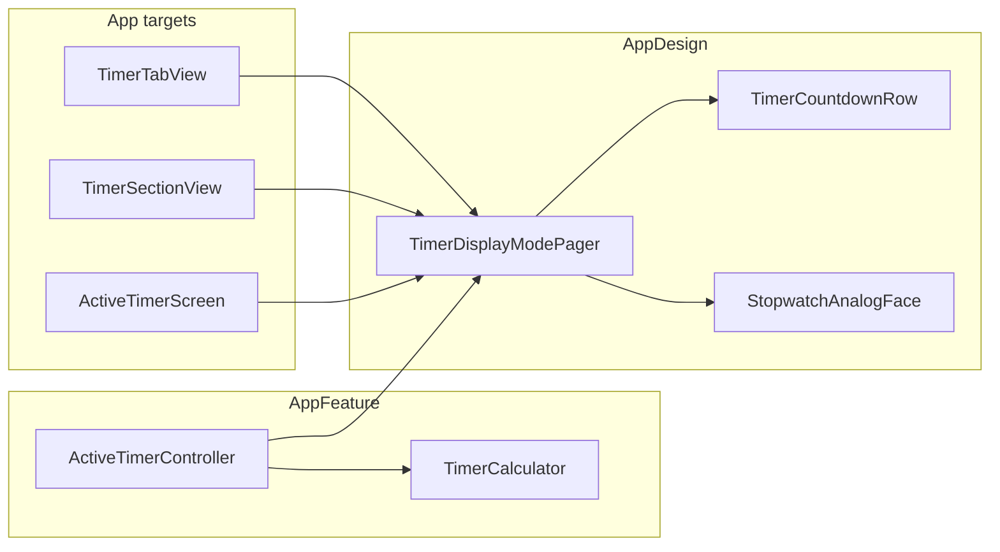

# Timer + Stopwatch dual display modes

## Goal

Replace the single centered countdown on the Timer tab with **two swipeable pages** (segmented dots, like Apple Clock):


| Page          | Style                 | Primary readout                                                                                                       |
| ------------- | --------------------- | --------------------------------------------------------------------------------------------------------------------- |
| **Timer**     | List-row (image 2)    | Large **remaining** time + session duration label (`25 min` / `3 hr`) + **inline circular Pause/Resume** on the right |
| **Stopwatch** | Analog face (image 3) | **Elapsed** on dial + digital `MM:SS.cs` in primary color; **finish wall-clock time in red** (e.g. `Ends 2:30 PM`)    |


Domain stays unchanged: one countdown session, no count-up mode in `TimerDomain`. Both pages are **presentation modes** over the same `ActiveTimerController` state.




---

## 1. Presentation API in `ActiveTimerController`

**File:** `[Packages/AppFeature/Sources/AppFeature/ActiveTimerController.swift](Packages/AppFeature/Sources/AppFeature/ActiveTimerController.swift)`

Add formatting-only APIs (all math via `TimerCalculator`; reuse `[TaskTimeLogController.formatDuration](Packages/AppFeature/Sources/AppFeature/TaskTimeLogController.swift)` for stopwatch digital text):


| Method                         | Purpose                                                                                                                                         |
| ------------------------------ | ----------------------------------------------------------------------------------------------------------------------------------------------- |
| `remainingListLabel(at:)`      | `H:MM:SS` when ≥1 hr (Apple-style `2:59:57`), else existing `m:ss`                                                                              |
| `sessionDurationLabel`         | Human preset label from active session duration: `25 min`, `1 hr`, `3 hr`                                                                       |
| `elapsedStopwatchDigital(at:)` | `MM:SS.cs` (centiseconds from fractional seconds)                                                                                               |
| `endTimeLabel(at:)`            | Wall-clock finish: `date + remaining(at:)` formatted with `DateFormatter` (locale-aware, no seconds) — **red in UI**; `nil` when idle/completed |
| `stopwatchHandAngles(at:)`     | `StopwatchHandAngles(seconds: Double, minutes: Double)` in degrees for Canvas                                                                   |


**Hand math (match Apple stopwatch):**

- Main seconds hand: `(elapsed % 60) / 60 × 360°`
- Sub-dial minutes hand: `(elapsed % 1800) / 1800 × 360°` (0–30 min per revolution)

Extract shared `fireDate(at:)` from existing live-activity sync logic so end time and notifications stay consistent.

**Tests:** extend `[Packages/AppFeature/Tests/AppFeatureTests/AppFeatureTests.swift](Packages/AppFeature/Tests/AppFeatureTests/AppFeatureTests.swift)` — remaining list label with hours, duration label, elapsed digital, end time shifts after pause/resume, hand angles at known elapsed values.

---

## 2. New `AppDesign` components

**New files under** `[Packages/AppDesign/Sources/AppDesign/](Packages/AppDesign/Sources/AppDesign/)`:

### `TimerCountdownRow.swift`

List-row layout (plain `String` inputs + action closures):

- Leading: large **thin** monospaced remaining (`TimerDisplay` variant or dedicated font token)
- Subtitle: session duration (`25 min`)
- Trailing: **icon-only circular control** with orange stroke when running (Pause/Resume); disabled/hidden when idle
- Horizontal divider lines optional (subtle `separator` color) to echo Apple Timers list
- `ViewThatFits` / `minimumScaleFactor` so long countdowns fit narrow widths (menu-bar panel, watch)

### `StopwatchAnalogFace.swift`

`Canvas` + `GeometryReader` — **no domain imports**:

- Main dial: tick marks (major every 5s, minor every 1s), numerals 5…60
- Sub-dial (top): 5…30 minute labels, smaller orange minute hand
- Main orange seconds hand from `secondsAngle`
- Center digital readout: elapsed string (primary color)
- Below dial: **end time string in `.red`** when non-nil; hidden when idle
- Size clamps: `min(diameter, geo.width - padding)` for responsive layout
- High contrast on watchOS ( thicker strokes, fewer numerals)

### `TimerDisplayModePager.swift`

Wrapper used by all platforms:

- `TabView` + `.tabViewStyle(.page(indexDisplayMode: .always))` for swipe + dots
- Page 0: `@ViewBuilder timerPage`
- Page 1: `@ViewBuilder stopwatchPage`
- `@SceneStorage("timerDisplayPage")` to remember last page per scene
- Accepts separate `TimelineView` schedules: **1 Hz** on timer page, **10 Hz** on stopwatch page (smooth hands + centiseconds) — timeline lives in app views, not inside dial shapes

### `TimerInlinePauseButton.swift` (small helper)

Circular 44–52 pt icon button with orange ring — used by list row and optionally duplicated on stopwatch page bottom controls.

**Tests:** `[Packages/AppDesign/Tests/AppDesignTests/AppDesignTests.swift](Packages/AppDesign/Tests/AppDesignTests/AppDesignTests.swift)` — verify row/pager init and that analog face accepts angle values without crashing (lightweight struct tests).

---

## 3. Platform view integration

### iOS — `[Apps/iOS/TimerTabView.swift](Apps/iOS/TimerTabView.swift)`

Restructure body:

```
NavigationStack
  VStack
    TimerDisplayModePager
      timer page → TimerCountdownRow (+ TimelineView 1s)
      stopwatch page → StopwatchAnalogFace (+ TimelineView 0.1s)
    relatedTaskButton (unchanged)
    durationPresets (idle only)
    primaryControls
      idle: Start (full width)
      active: Stop + Reset row (Pause moves to list-row; stopwatch page gets Lap-free Start/Pause/Stop row matching Apple: green Start/Pause, red Stop at bottom)
    sessionHint
```

**Control placement:**

- **Timer page:** Pause/Resume only in the list-row trailing button (Apple pattern)
- **Stopwatch page:** bottom **Lap-free** control row — green Start/Pause, red Stop (same actions as today; no lap feature)
- **Stop** and **Reset** remain shared below the pager on both pages

Idle placeholders:

- Timer page: gray `25:00` (or selected preset) + duration chip label
- Stopwatch page: dial at zero, digital `00:00.00`, no red end time

### macOS — `[Apps/macOS/TimerSectionView.swift](Apps/macOS/TimerSectionView.swift)`

Same pager; dial `maxDiameter` ~220 in menu-bar panel, ~280 in Task Hub pane (pass via existing `displayFontSize` / new `dialDiameter` init param). Keyboard shortcuts unchanged. List-row pause button gets `accessibilityIdentifier`s matching iOS.

### watchOS — `[Apps/watchOS/ActiveTimerScreen.swift](Apps/watchOS/ActiveTimerScreen.swift)`

Embed pager inside existing timer screen:

- Smaller dial (~140 pt), drop sub-dial numerals to 10/20/30 only
- Page dots at bottom (Apple Watch stopwatch pattern)
- Centiseconds optional at 1 Hz on watch (battery); document in code comment
- Controls: keep compact Pause/Stop `HStack` below pager

**Unchanged:** `[TaskTimerActionBar](Packages/AppDesign/Sources/AppDesign/TimerControls.swift)`, menu-bar countdown, Live Activity — still use `compactLabel` (remaining).

---

## 4. Visual tokens (Apple Clock alignment)

Add to `[Packages/AppDesign/Sources/AppDesign/Tokens.swift](Packages/AppDesign/Sources/AppDesign/Tokens.swift)` or inline in components:


| Token                    | Value                                 | Use                                   |
| ------------------------ | ------------------------------------- | ------------------------------------- |
| `timerListRemainingFont` | `.system(size: 56–72, weight: .thin)` | Timer page headline                   |
| `stopwatchHandColor`     | `.orange`                             | Analog hands (Apple stopwatch accent) |
| `stopwatchEndTimeColor`  | `.red`                                | Finish time label                     |
| `timerPauseRingColor`    | `.orange`                             | Inline pause button stroke            |


Respect `[docs/DESIGN_SYSTEM.md](docs/DESIGN_SYSTEM.md)`: monospaced digits, 1 Hz default tick, Dynamic Type via `minimumScaleFactor`, VoiceOver labels on both pages (`"25 minutes remaining, ends 2:30 PM"` combined label on stopwatch page).

---

## 5. Accessibility and UI tests

- **Identifiers:** keep `timer.display`; add `timer.countdownRow`, `timer.stopwatchDial`, `timer.displayPage.timer`, `timer.displayPage.stopwatch`, `timer.inlinePause`
- Update `[Apps/iOSUITests/TaskTrackerIOSUITests.swift](Apps/iOSUITests/TaskTrackerIOSUITests.swift)` if tests assert old single-header layout
- VoiceOver: page changes announce "Timer" / "Stopwatch"; end time included when running

---

## 6. Documentation

- `[docs/DESIGN_SYSTEM.md](docs/DESIGN_SYSTEM.md)` — new subsection under iOS/watchOS timer: dual display modes, pager, color semantics (elapsed primary, end time red), platform sizing notes
- `[memory.md](memory.md)` — note Timer tab dual-view UI shipped

---

## Out of scope (explicit)

- **Lap list** (Apple stopwatch laps) — not requested; would need new domain events
- **Multiple concurrent timers** (Apple Timers list) — app has one global session
- **Changing Live Activity / menu-bar** to show elapsed — they stay countdown
- **Analog dial on menu-bar panel** — too small; list-row timer page only there

---

## Verification checklist

1. `xcrun swift test` — AppFeature formatter tests + existing timer tests pass
2. Build iOS, macOS, watchOS targets (zero Swift 6 concurrency warnings)
3. Manual: swipe between pages while running; pause from list-row; confirm red end time updates after pause/resume
4. iPhone 11 / floor simulators: material fallbacks, Dynamic Type largest size, Reduce Motion (no hand animation beyond TimelineView ticks)

